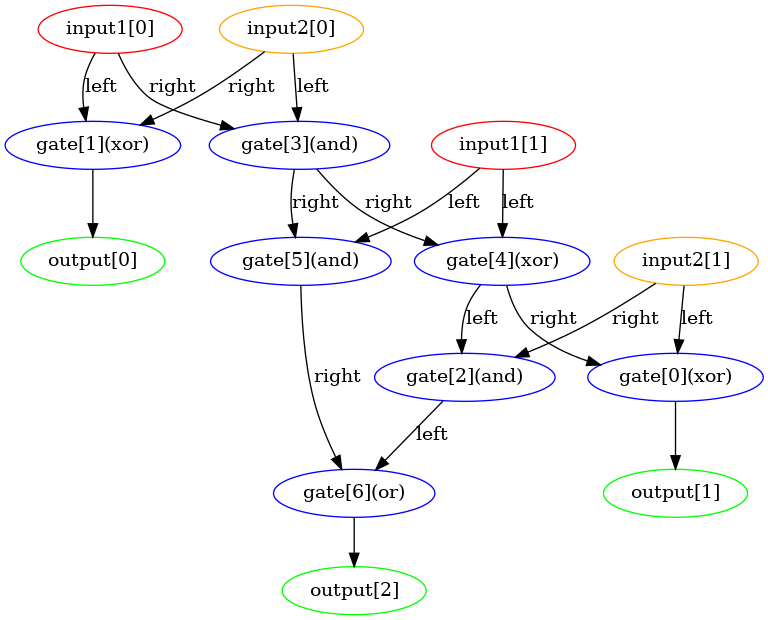

# Adder Evolution

## Introduction
Adder Evolution is an approach to generate adders with evolutionary algorithms.

* The program defines an adder consisting of some gates, and a world consisting of one default adder.
* Each time the world runs, adders in the world will give birth to new adders, and new adders will mutate and become a bit different from old ones. The birth rate is controlled by the performance in which the adder will answer add questions. The more it answers correctly, the higher the birth rate.
* If the number of adders hits the limit, the world will get rid of bad performance ones.

By running world and drawing adder, you can get a adder from scratchlike below.



More detailed thought about how to design and develop this project can be found in my [blog](https://chasemao.com/article/adder-evolution).

## Installation

`Python 3.12.4` has been tested, it should be compatiable with `Python >= 3.8`.

After `git clone`, should run following to install dependancy.

```shell
pip install -r requirements.txt

# Note that draw adder relay on install graphviz and pygraphviz
sudo apt-get install python3.12-dev
sudo apt-get install graphviz graphviz-dev
```

## Usage

The program provides two modes:

1. Run a world to adders.
   * Use `--run_world` to run a world and within it there will be adders evolving.
   * Use `-o` to decide the output path for saving the world, it defaults to the "save" directory in the project.
   * Use `-i` to resume the world from a world saving file.
   * Other config can be found in [Arguments](#Arguments).
   * The priority of the config is: input > file > default.
2. Draw an adder from a world save file, you can see clearly how the adder organizes its gates inside it.
   * Use `--draw_adder` to draw an adder from a save file of the world.
   * Use `-i` to decide which world saving file to use.
   * Use `--index` to decide which adder to draw.
   * Use `-o` to decide the output path for the drawing adder file.


```shell
sudo apt-get install graphviz graphviz-dev
```

## Arguments

The following arguments can be used with the program:

* Run world mode:
  * `--run_world`: Run a world to adders.
  * `-d`, `--digits`: The input digits of the adder, must be greater than 0, default 2.
  * `-b`, `--birth_rate`: The base birth rate of the adder, must be greater than 1, default 2.
  * `-m`, `--mutation_rate`: The base mutation rate of the adder, must be greater than 0 and less than 1, default 0.9.
  * `-max`, `--max_number`: The maximum number of adders that can exist. When the number of adders exceeds it, adders that have a disadvantage in the addition task will be eliminated, must be greater than 0, default 10000.
  * `-s`, `--save_interval`: The save interval of the world in generation, less than or equal to 0 means no save, default 1.
  * `-r`, `--run_generation`: How many generations the world will run, default endless.

* Draw adder mode:
  * `--draw_adder`: Draw an adder from a save file of the world.
  * `--index`: The index of the adder in the world to draw.

* Common use:
  * `-i`, `--input_path`: The input path of the saving world. Resume world or draw an adder from it.
  * `-o`, `--output_path`: The output path of the saving world.

## Examples

To run a world and save it to the default directory "save", use the following command:

```shell
python main.py --run_world
```

To draw an adder from a save file of the world and save it to the default directory "save", use the following command:

```shell
python main.py --draw_adder -i path/to/world/save/file -o path/to/adder/save/file --index 0
```

## License

This project is licensed under the [Apache License](./LICENSE).